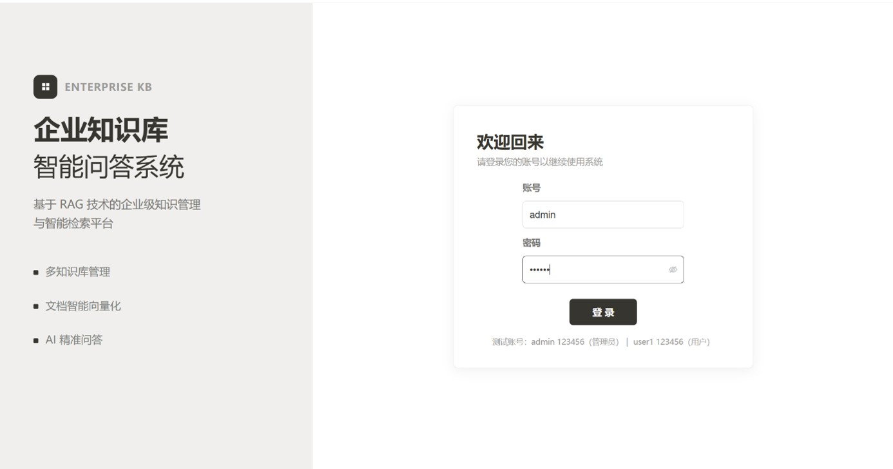
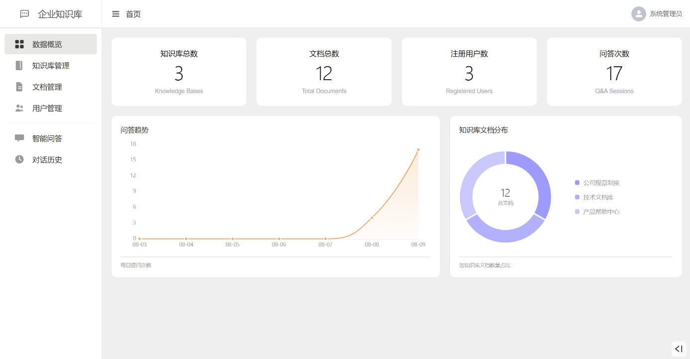
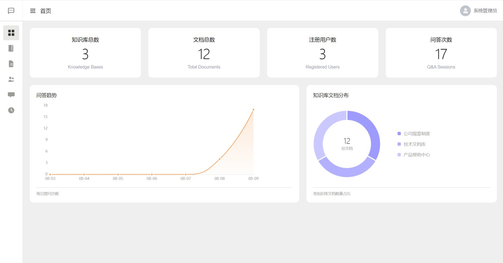
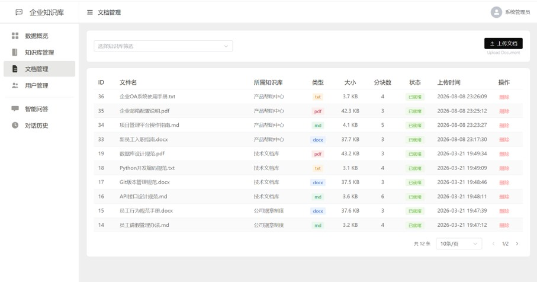
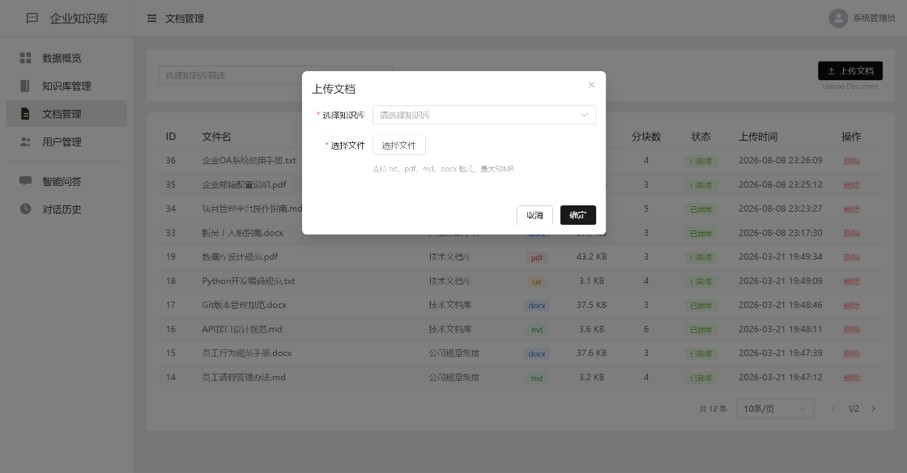
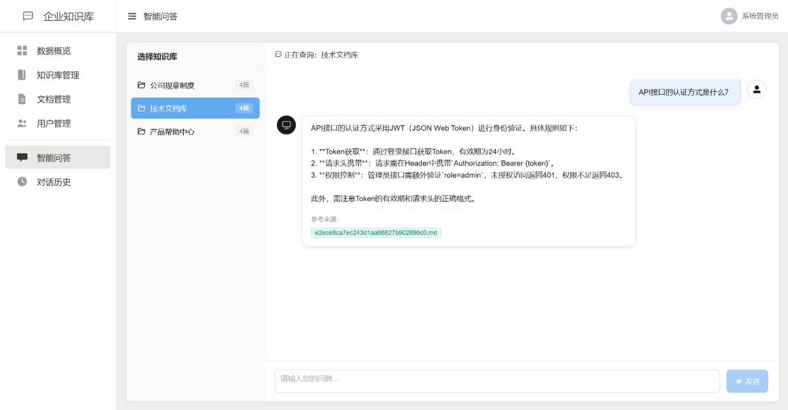

# EnterpriseQA 

**企业级 RAG 智能问答系统**

基于检索增强生成（RAG）技术构建的企业内部知识库智能问答平台，支持文档上传、自动向量化、语义检索和 AI 对话，让企业知识触手可及。

---

## 功能特性

- **智能问答** — 基于 RAG 架构，结合企业知识库精准回答用户问题，并标注参考来源
- **知识库管理** — 支持创建多个独立知识库，按业务场景分类管理企业文档
- **多格式文档支持** — 支持 PDF、Word（.docx）、Markdown、TXT 四种常见文档格式的上传与解析
- **本地化部署** — 使用 Ollama 本地运行大语言模型（Qwen3），数据不出内网，安全可控
- **对话历史** — 完整记录问答历史，支持会话级对话回溯
- **用户权限体系** — 基于 JWT 的身份认证，区分管理员与普通用户角色
- **数据统计面板** — 可视化展示知识库、文档、问答等运营数据
- **现代化前端界面** — Vue 3 + Element Plus 构建的响应式 Web 界面

---

##技术架构

```
┌─────────────────────────────────────────────────────┐
│                    前端 (Client)                      │
│   Vue 3 · Vite · Element Plus · Pinia · ECharts     │
│              Axios · Vue Router                       │
└──────────────────────┬──────────────────────────────┘
                       │ HTTP / REST API
┌──────────────────────▼──────────────────────────────┐
│                    后端 (Server)                      │
│         Flask · Flask-SQLAlchemy · PyJWT             │
│  ┌──────────┐ ┌───────────┐ ┌──────────────────┐    │
│  │ 认证模块  │ │ 知识库管理 │ │   RAG 核心服务    │    │
│  │  Auth    │ │ Document  │ │  LangChain+Ollama │    │
│  └──────────┘ └───────────┘ └────────┬─────────┘    │
│                                    │                │
│  ┌──────────┐ ┌───────────┐        ▼                │
│  │ 用户管理  │ │ 统计面板  │  ChromaDB 向量存储      │
│  │  User    │ │  Stats    │  (持久化)               │
│  └──────────┘ └───────────┘                          │
└──────────────────────┬──────────────────────────────┘
                       │
              ┌────────▼────────┐
              │   MySQL 数据库   │
              │  (用户/元数据)   │
              └─────────────────┘
```

### 技术栈

| 层级 | 技术 | 说明 |
|------|------|------|
| **前端框架** | Vue 3.5 | 渐进式 JavaScript 框架 |
| **构建工具** | Vite 8 | 下一代前端构建工具 |
| **UI 组件库** | Element Plus 2 | 基于 Vue 3 的桌面端组件库 |
| **状态管理** | Pinia 3 | Vue 官方推荐的状态管理库 |
| **图表可视化** | ECharts 6 | 开源数据可视化图表库 |
| **后端框架** | Flask 3.1 | 轻量级 Python Web 框架 |
| **ORM** | Flask-SQLAlchemy | Python SQL 工具包及 ORM |
| **数据库** | MySQL | 关系型数据库（存用户、知识库元数据） |
| **向量数据库** | ChromaDB 0.6 | 嵌入式向量数据库（存文档向量） |
| **LLM 引擎** | Ollama + Qwen3:1.7b | 本地运行的大语言模型 |
| **嵌入模型** | Qwen3-Embedding:4b | 文本向量化模型 |
| **RAG 框架** | LangChain 0.3 | 构建 LLM 应用的开发框架 |
| **认证** | JWT (PyJWT) | JSON Web Token 身份验证 |

---

## 项目结构

```
EnterpriseQA/
├── client/                     # 前端项目
│   ├── src/
│   │   ├── api/                # API 接口封装
│   │   │   ├── auth.js         #   认证接口
│   │   │   ├── chat.js         #   问答接口
│   │   │   ├── document.js     #   文档接口
│   │   │   ├── knowledge.js    #   知识库接口
│   │   │   ├── user.js         #   用户接口
│   │   │   └── stats.js        #   统计接口
│   │   ├── components/         # 公共组件
│   │   │   └── ChatMessage.vue #   聊天消息组件
│   │   ├── views/              # 页面视图
│   │   │   ├── Login.vue       #   登录页
│   │   │   ├── Layout.vue      #   布局框架
│   │   │   ├── Home.vue        #   首页/仪表盘
│   │   │   ├── Chat.vue        #   智能问答页
│   │   │   ├── ChatHistory.vue #   对话历史页
│   │   │   ├── KnowledgeBase.vue#   知识库管理页
│   │   │   ├── Document.vue    #   文档管理页
│   │   │   └── UserManage.vue  #   用户管理页
│   │   ├── stores/             # Pinia 状态管理
│   │   ├── router/             # 路由配置
│   │   ├── App.vue             # 根组件
│   │   └── main.js             # 入口文件
│   ├── package.json
│   └── vite.config.js
│
├── server/                     # 后端项目
│   ├── config.py               # 全局配置文件
│   ├── app.py                  # Flask 应用入口（应用工厂）
│   ├── requirements.txt        # Python 依赖清单
│   ├── models/                 # 数据模型（SQLAlchemy）
│   │   ├── user.py             #   用户模型
│   │   ├── knowledge_base.py   #   知识库模型
│   │   ├── document.py         #   文档模型
│   │   └── chat_history.py     #   对话历史模型
│   ├── routes/                 # API 路由（蓝图）
│   │   ├── auth.py             #   /api/auth   — 登录注册
│   │   ├── knowledge_base.py   #   /api/knowledge_base — 知识库CRUD
│   │   ├── document.py         #   /api/document — 文档上传与管理
│   │   ├── chat.py             #   /api/chat    — RAG问答 & 历史
│   │   ├── user.py             #   /api/user    — 用户管理
│   │   └── stats.py            #   /api/stats   — 数据统计
│   ├── services/               # 核心业务服务
│   │   ├── rag_service.py      #   RAG 问答核心服务
│   │   └── vector_service.py   #   文档向量化服务
│   ├── sql/init.sql            # 数据库初始化脚本
│   ├── test_docs/              # 测试文档（示例）
│   └── chroma_data/            # ChromaDB 持久化数据
│
├── .gitignore
├── LICENSE
└── README.md
```

---

## 快速开始

### 环境要求

- **Python** ≥ 3.10
- **Node.js** ≥ 18
- **MySQL** ≥ 8.0
- **Ollama** （用于本地运行 LLM）

### 1️⃣ 安装 Ollama 并拉取模型

```bash
# 安装 Ollama（如未安装请访问 https://ollama.com 下载）
# 拉取大语言模型
ollama pull qwen3:1.7b

# 拉取文本嵌入模型
ollama pull qwen3-embedding:4b

# 启动 Ollama 服务
ollama serve
```

> 确保 Ollama 服务在 `http://localhost:11434` 正常运行

### 2️⃣ 初始化后端

```bash
cd server

# 创建虚拟环境（推荐）
python -m venv venv
venv\Scripts\activate    # Windows
# source venv/bin/activate  # Linux/macOS

# 安装 Python 依赖
pip install -r requirements.txt

# 配置 MySQL 数据库
# 1. 创建数据库：CREATE DATABASE db_enterprise_qa DEFAULT CHARSET utf8mb4;
# 2. 执行初始化脚本：mysql -u root -p < sql/init.sql

# 启动后端服务
python app.py
```

后端默认运行在 `http://localhost:5000`

### 3️⃣ 启动前端

```bash
cd client

# 安装 Node.js 依赖
npm install

# 启动开发服务器
npm run dev
```

前端默认运行在 `http://localhost:5173`

### 4️⃣ 访问系统

打开浏览器访问 `http://localhost:5173`，使用管理员账号登录：

| 角色 | 默认账号 | 说明 |
|------|---------|------|
| 管理员 | 见 `sql/init.sql` | 拥有所有功能权限 |

---

## RAG 工作流程

```
用户提问
   │
   ▼
┌──────────────┐
│  问题向量化   │ ← Ollama Embedding Model
└──────┬───────┘
       │
       ▼
┌──────────────┐
│  相似度检索   │ ← ChromaDB 向量数据库（Top-K = 4）
│  返回相关文档  │
└──────┬───────┘
       │
       ▼
┌──────────────┐
│  构建提示词   │ ← 将检索到的文档作为上下文注入
└──────┬───────┘
       │
       ▼
┌──────────────┐
│  LLM 生成回答 │ ← Ollama Qwen3:1.7b
│  + 标注来源   │
└──────────────┘
```

---

## 配置说明

主要配置项位于 `server/config.py`，可通过环境变量覆盖：

| 配置项 | 默认值 | 说明 |
|--------|--------|------|
| `MYSQL_HOST` | 127.0.0.1 | MySQL 地址 |
| `MYSQL_PORT` | 3306 | MySQL 端口 |
| `MYSQL_DATABASE` | db_enterprise_qa | 数据库名 |
| `OLLAMA_BASE_URL` | http://localhost:11434 | Ollama 服务地址 |
| `OLLAMA_LLM_MODEL` | qwen3:1.7b | 大语言模型名称 |
| `OLLAMA_EMBED_MODEL` | qwen3-embedding:4b | 嵌入模型名称 |
| `CHUNK_SIZE` | 500 | 文档分块字符数 |
| `CHUNK_OVERLAP` | 50 | 分块重叠字符数 |
| `RETRIEVER_TOP_K` | 4 | 检索返回的文档数量 |

---

## 功能截图

### 首页仪表盘


### 智能问答


### 知识库管理


### 文档上传与管理


### 对话历史


### 用户管理


---

## 贡献指南

欢迎提交 Issue 和 Pull Request！

1. Fork 本仓库
2. 创建特性分支 (`git checkout -b feature/amazing-feature`)
3. 提交更改 (`git commit -m 'Add amazing feature'`)
4. 推送到分支 (`git push origin feature/amazing-feature`)
5. 提交 Pull Request

---

## 许可证

本项目基于 [MIT License](LICENSE) 开源。

---

## 致谢

- [LangChain](https://github.com/langchain-ai/langchain) — RAG 应用开发框架
- [Ollama](https://github.com/ollama/ollama) — 本地大语言模型运行工具
- [ChromaDB](https://github.com/chroma-core/chroma) — 开源嵌入式向量数据库
- [Vue.js](https://github.com/vuejs/core) — 渐进式 JavaScript 框架
- [Element Plus](https://github.com/element-plus/element-plus) — Vue 3 UI 组件库
- [Qwen](https://github.com/QwenLM/Qwen3) — 通义千问大语言模型

---

<p align="center">
  Made with by <a href="https://github.com/Kikki-Fim">Kikki-Fim</a>
</p>
